# Full Stack Chat App

A real-time chat application developed with React.js and Firebase that offers comprehensive messaging and user management features. Users can create accounts, chat with others, and manage their contacts in a secure and intuitive environment.


## Creat Acount
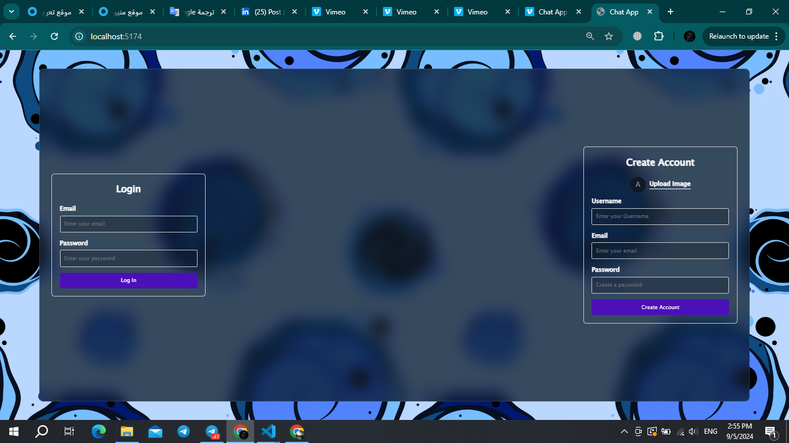
## Login Page
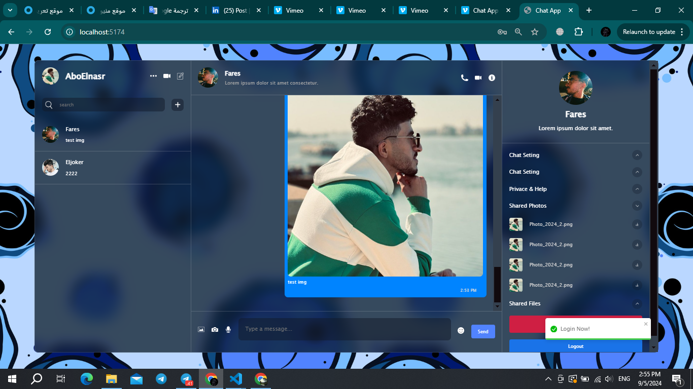
## Send Imeage & Text & Emoji
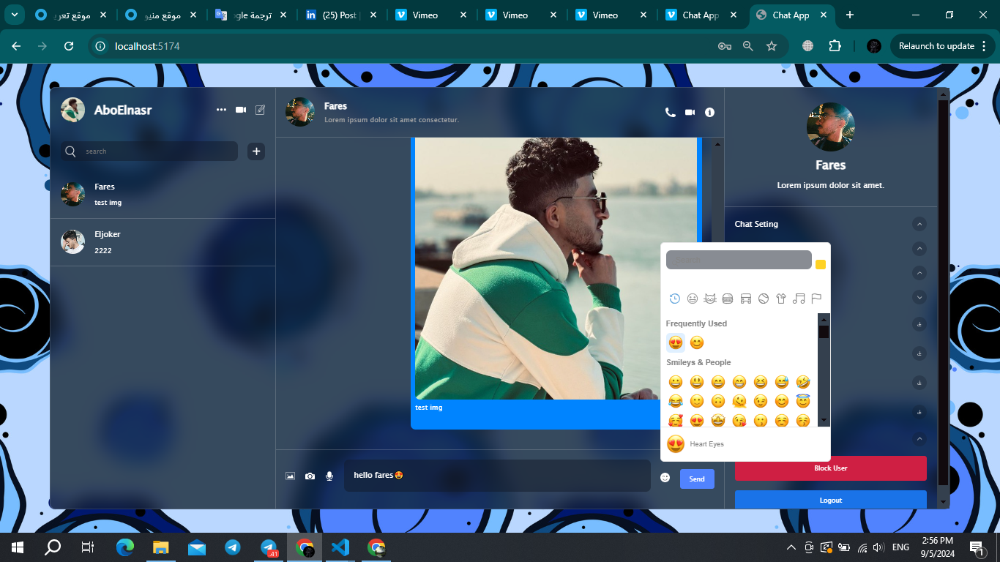
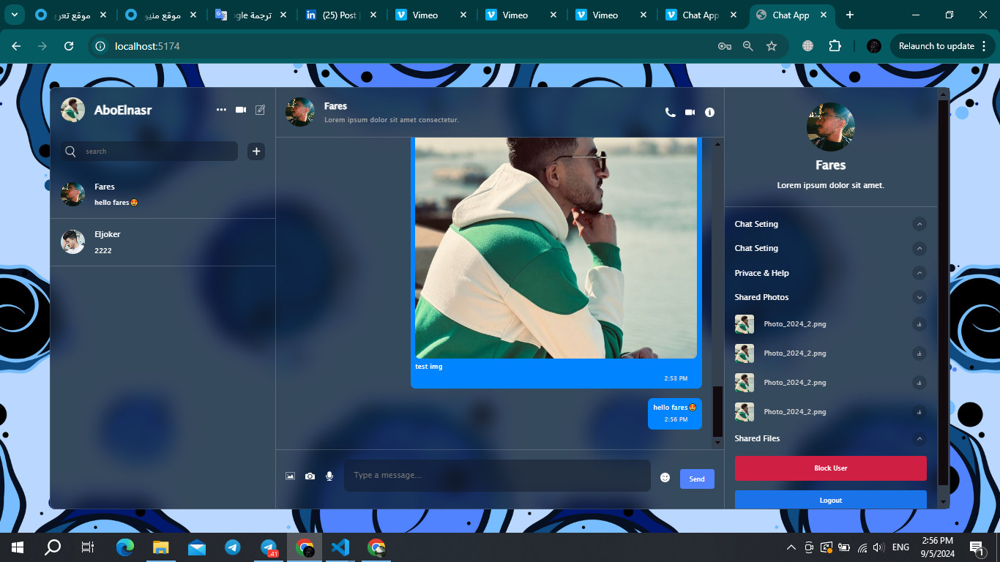
## The color of the chat changes according to the username of the message sender.
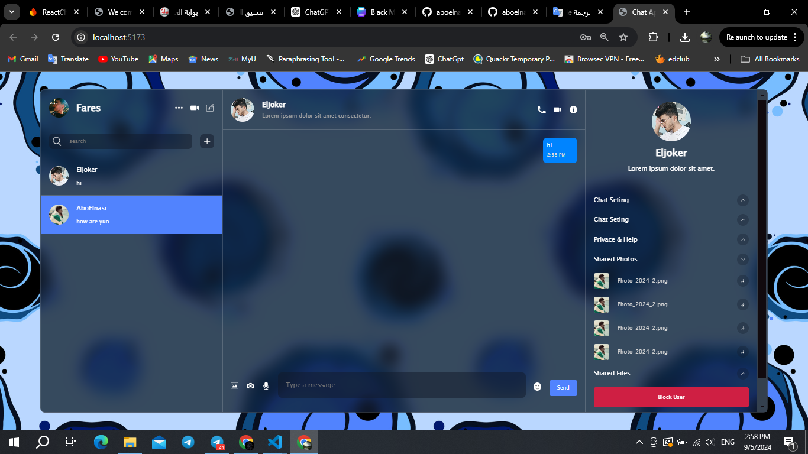
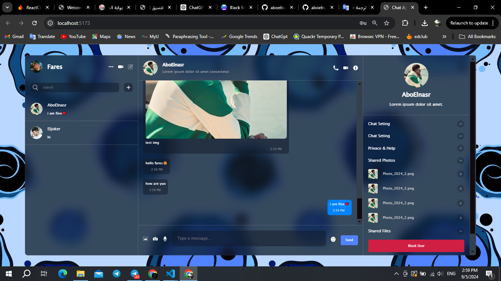
## Real time
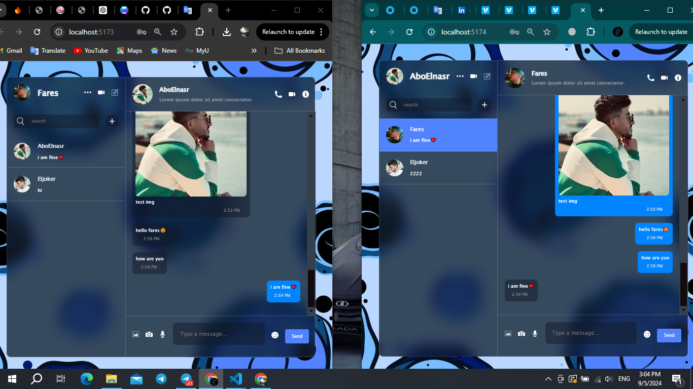
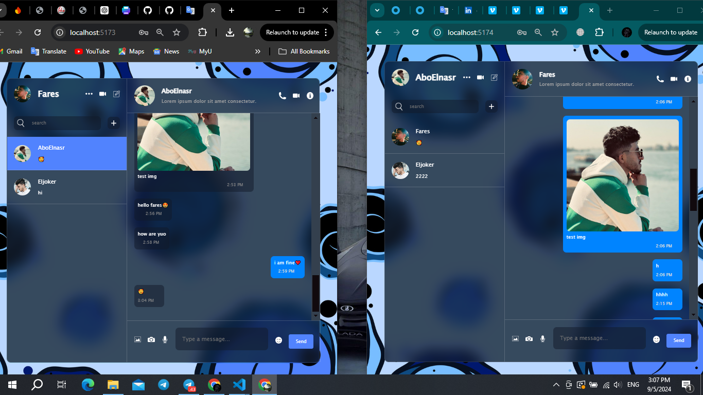
## Add a new user to chat with
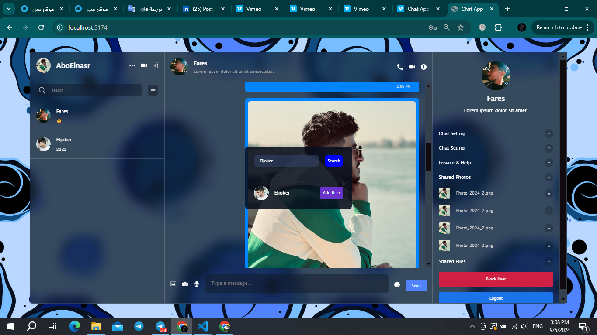
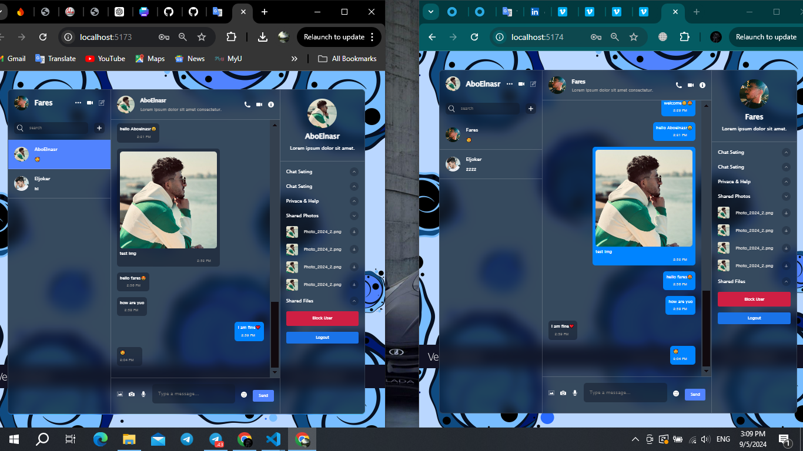

## Block User
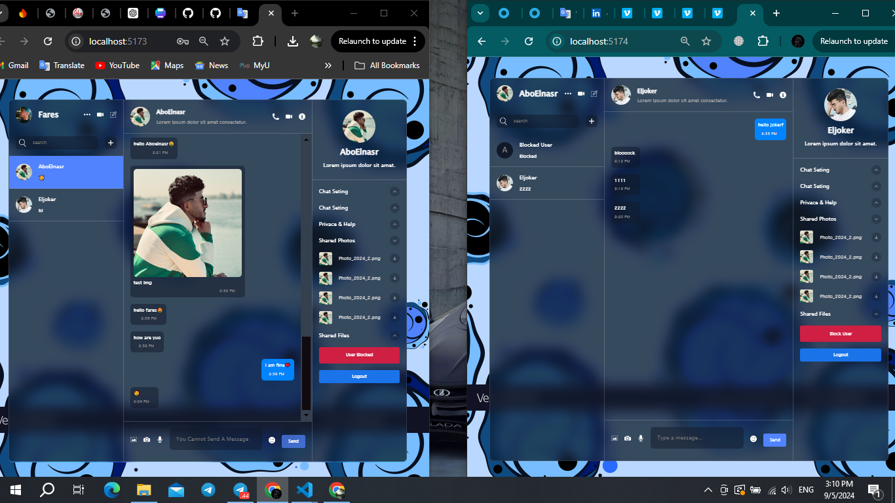


## Features

- **Authentication**: Secure user registration and login using Firebase.
- **User Management**: Create, search, and chat with other users.
- **Real-time Messaging**: Send text, photos, and emojis instantly.
- **Blocking Functionality**: Block users to prevent them from sending and receiving messages.
- **State Management**: Efficient state management using Zustand.
- **Notifications**: Integrated React Toastify for real-time user notifications.

## Technologies Used

- **Frontend**: React.js, Zustand, Vite
- **Backend**: Firebase for authentication, real-time database, and cloud storage
- **UI Components**: Emoji Picker React for emoji support
- **Notifications**: React Toastify for alerts and notifications

## Installation

1. **Clone the repository:**

   ```bash
   git clone https://github.com/aboelnasrvip/Chat_App_With_React_Firebase.git
   cd Chat_App_With_React_Firebase

2. **Install dependencies:**
   ```bash
   npm install

3. **Create a Firebase project:**
    - **Go to .**: Firebase Console
    - Create a new project and enable Authentication, Firestore Database, and Storage.
    - Obtain your Firebase configuration and replace the configuration values in the project.


4. **Set up environment variables::**
    - Create a **.env** file in the root of your project and add your Firebase configuration:
   ```bash
   VITE_FIREBASE_API_KEY=your_api_key
   VITE_FIREBASE_AUTH_DOMAIN=your_auth_domain
   VITE_FIREBASE_PROJECT_ID=your_project_id
   VITE_FIREBASE_STORAGE_BUCKET=your_storage_bucket
   VITE_FIREBASE_MESSAGING_SENDER_ID=your_messaging_sender_id
   VITE_FIREBASE_APP_ID=your_app_id


5. **Run the application:**
   ```bash
   npm run dev


## Usage

- **Sign Up: Create a new account using your email and password.**
- **Login: Log in to your account to access chat features.**
- **Search Users: Find other users to chat with.**
- **Messaging: Send text messages, photos, and emojis.**
- **Block Users: Block users to prevent them from interacting with you.**
- **Notifications: Receive notifications for messages and actions.**


